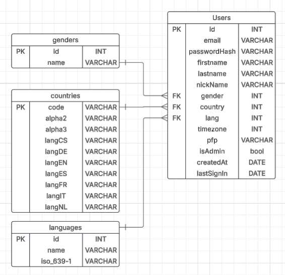

# Documentación de la base de datos
> Este proyecto hizo uso de dos bases de datos. Una relacional, específicamente MS SQL Server. Y una no relacional: Firestore.

## Modelo lógico de datos
```
Firestore (Database)
├── availablePermissions (Collection)
│   ├── permissionID (Doc)
│      ├── category
│      ├── description
│      ├── key
├── projectRoles (Collection)
│   ├── roleId (Doc)
│      ├── name
│      ├── permissions
├── projects (Collection)
│   ├── projectId (Doc)
│      ├── conext
│      ├── createdAt
│      ├── description
│      ├── name
│      ├── ownerID
│      ├── status
│      ├── members (Collection)
|      │    ├── memberId (Doc)
|      │        ├── joinedAt
|      │        ├── projectRoleID
|      │        ├── userId
│      ├── backlog (Collection)
|      │    ├── backlogItemId (Doc)
|      │    |   ├── Acceptance Criteria
|      │    |   ├── assignee Id
|      │    |   ├── authorId
|      │    |   ├── coverImage
|      │    |   ├── createdAt
|      │    |   ├── description


```

## Diagrama ER de la BD Relacional


## Script SQL de la BD Relacional
```sql
-- Date: 2025-03-28

-- Creación de la tabla `countries`

CREATE TABLE Countries (
  code INT NOT NULL,
  alpha2 varchar(2) PRIMARY KEY NOT NULL,
  alpha3 varchar(3) UNIQUE NOT NULL,
  langCS varchar(45) UNIQUE NOT NULL,
  langDE varchar(45) NOT NULL,
  langEN varchar(45) NOT NULL,
  langES varchar(45) NOT NULL,
  langFR varchar(45) NOT NULL,
  langIT varchar(45) NOT NULL,
  langNL varchar(45) NOT NULL,
)

INSERT INTO Countries (code, alpha2, alpha3, langCS, langDE, langEN, langES, langFR, langIT, langNL) VALUES
(4, 'AF', 'AFG', 'Afghanistán', 'Afghanistan', 'Afghanistan', 'Afganistán', 'Afghanistan', 'Afghanistan', 'Afghanistan'),
(8, 'AL', 'ALB', 'Albánie', 'Albanien', 'Albania', 'Albania', 'Albanie', 'Albania', 'Albanië'),
(10, 'AQ', 'ATA', 'Antarctica', 'Antarktis', 'Antarctica', 'Antartida', 'Antarctique', 'Antartide', 'Antarctica'),
(12, 'DZ', 'DZA', 'Alžírsko', 'Algerien', 'Algeria', 'Argelia', 'Algérie', 'Algeria', 'Algerije'),
(16, 'AS', 'ASM', 'Americká Samoa', 'Amerikanisch-Samoa', 'American Samoa', 'Samoa americana', 'Samoa Américaines', 'Samoa Americane', 'Amerikaans Samoa'),
(20, 'AD', 'AND', 'Andorra', 'Andorra', 'Andorra', 'Andorra', 'Andorre', 'Andorra', 'Andorra'),
(24, 'AO', 'AGO', 'Angola', 'Angola', 'Angola', 'Angola', 'Angola', 'Angola', 'Angola'),
(28, 'AG', 'ATG', 'Antigua a Barbuda', 'Antigua und Barbuda', 'Antigua and Barbuda', 'Antigua y Barbuda', 'Antigua-et-Barbuda', 'Antigua e Barbuda', 'Antigua en Barbuda'),
(31, 'AZ', 'AZE', 'Azerbajdžán', 'Aserbaidschan', 'Azerbaijan', 'Azerbaiyán', 'Azerbaïdjan', 'Azerbaijan', 'Azerbeidzjan'),
(32, 'AR', 'ARG', 'Argentina', 'Argentinien', 'Argentina', 'Argentina', 'Argentine', 'Argentina', 'Argentinië'),
(36, 'AU', 'AUS', 'Austrálie', 'Australien', 'Australia', 'Australia', 'Australie', 'Australia', 'Australië'),
(40, 'AT', 'AUT', 'Rakousko', 'Österreich', 'Austria', 'Austria', 'Autriche', 'Austria', 'Oostenrijk'),
(44, 'BS', 'BHS', 'Bahamy', 'Bahamas', 'Bahamas', 'Bahamas', 'Bahamas', 'Bahamas', 'Bahama''s'),
(48, 'BH', 'BHR', 'Bahrajn', 'Bahrain', 'Bahrain', 'Bahrain', 'Bahreïn', 'Bahrain', 'Bahrein'),
(50, 'BD', 'BGD', 'Bangladéš', 'Bangladesch', 'Bangladesh', 'Bangladesh', 'Bangladesh', 'Bangladesh', 'Bangladesh'),
(51, 'AM', 'ARM', 'Arménie', 'Armenien', 'Armenia', 'Armenia', 'Arménie', 'Armenia', 'Armenië'),
(52, 'BB', 'BRB', 'Barbados', 'Barbados', 'Barbados', 'Barbados', 'Barbade', 'Barbados', 'Barbados'),
(56, 'BE', 'BEL', 'Belgie', 'Belgien', 'Belgium', 'Bélgica', 'Belgique', 'Belgio', 'België'),
(60, 'BM', 'BMU', 'Bermuda', 'Bermuda', 'Bermuda', 'Bermuda', 'Bermudes', 'Bermuda', 'Bermuda'),
(64, 'BT', 'BTN', 'Bhután', 'Bhutan', 'Bhutan', 'Bhutan', 'Bhoutan', 'Bhutan', 'Bhutan'),
(68, 'BO', 'BOL', 'Bolívie', 'Bolivien', 'Bolivia', 'Bolivia', 'Bolivie', 'Bolivia', 'Bolivia'),
(70, 'BA', 'BIH', 'Bosna a Hercegovina', 'Bosnien und Herzegowina', 'Bosnia and Herzegovina', 'Bosnia y Herzegovina', 'Bosnie-Herzégovine', 'Bosnia Erzegovina', 'Bosnië-Herzegovina'),
(72, 'BW', 'BWA', 'Botswana', 'Botswana', 'Botswana', 'Botswana', 'Botswana', 'Botswana', 'Botswana'),
(74, 'BV', 'BVT', 'Bouvet Island', 'Bouvetinsel', 'Bouvet Island', 'Isla Bouvet', 'Île Bouvet', 'Isola di Bouvet', 'Bouvet'),
(76, 'BR', 'BRA', 'Brazílie', 'Brasilien', 'Brazil', 'Brasil', 'Brésil', 'Brasile', 'Brazilië'),
(84, 'BZ', 'BLZ', 'Belize', 'Belize', 'Belize', 'Belize', 'Belize', 'Belize', 'Belize'),
(86, 'IO', 'IOT', 'Britské Indickooceánské teritorium', 'Britisches Territorium im Indischen Ozean', 'British Indian Ocean Territory', 'Territorio Oceánico de la India Británica', 'Territoire Britannique de l''Océan Indien', 'Territori Britannici dell''Oceano Indiano', 'British Indian Ocean Territory'),
(90, 'SB', 'SLB', 'Šalamounovy ostrovy', 'Salomonen', 'Solomon Islands', 'Islas Salomón', 'Îles Salomon', 'Isole Solomon', 'Salomonseilanden'),
(92, 'VG', 'VGB', 'Britské Panenské ostrovy', 'Britische Jungferninseln', 'British Virgin Islands', 'Islas Vírgenes Británicas', 'Îles Vierges Britanniques', 'Isole Vergini Britanniche', 'Britse Maagdeneilanden'),
(96, 'BN', 'BRN', 'Brunej', 'Brunei Darussalam', 'Brunei Darussalam', 'Brunei Darussalam', 'Brunéi Darussalam', 'Brunei Darussalam', 'Brunei'),
(100, 'BG', 'BGR', 'Bulharsko', 'Bulgarien', 'Bulgaria', 'Bulgaria', 'Bulgarie', 'Bulgaria', 'Bulgarije'),
(104, 'MM', 'MMR', 'Myanmar', 'Myanmar', 'Myanmar', 'Mianmar', 'Myanmar', 'Myanmar', 'Myanmar'),
(108, 'BI', 'BDI', 'Burundi', 'Burundi', 'Burundi', 'Burundi', 'Burundi', 'Burundi', 'Burundi'),
(112, 'BY', 'BLR', 'Bělorusko', 'Belarus', 'Belarus', 'Belarus', 'Bélarus', 'Bielorussia', 'Wit-Rusland'),
(116, 'KH', 'KHM', 'Kambodža', 'Kambodscha', 'Cambodia', 'Camboya', 'Cambodge', 'Cambogia', 'Cambodja'),
(120, 'CM', 'CMR', 'Kamerun', 'Kamerun', 'Cameroon', 'Camerún', 'Cameroun', 'Camerun', 'Kameroen'),
(124, 'CA', 'CAN', 'Kanada', 'Kanada', 'Canada', 'Canadá', 'Canada', 'Canada', 'Canada'),
(132, 'CV', 'CPV', 'Ostrovy Zeleného mysu', 'Kap Verde', 'Cape Verde', 'Cabo Verde', 'Cap-vert', 'Capo Verde', 'Kaapverdië'),
(136, 'KY', 'CYM', 'Kajmanské ostrovy', 'Kaimaninseln', 'Cayman Islands', 'Islas Caimán', 'Îles Caïmanes', 'Isole Cayman', 'Caymaneilanden'),
(140, 'CF', 'CAF', 'Středoafrická republika', 'Zentralafrikanische Republik', 'Central African', 'República Centroafricana', 'République Centrafricaine', 'Repubblica Centroafricana', 'Centraal-Afrikaanse Republiek'),
(144, 'LK', 'LKA', 'Srí Lanka', 'Sri Lanka', 'Sri Lanka', 'Sri Lanka', 'Sri Lanka', 'Sri Lanka', 'Sri Lanka'),
(148, 'TD', 'TCD', 'Čad', 'Tschad', 'Chad', 'Chad', 'Tchad', 'Ciad', 'Tsjaad'),
(152, 'CL', 'CHL', 'Chile', 'Chile', 'Chile', 'Chile', 'Chili', 'Cile', 'Chili'),
(156, 'CN', 'CHN', 'Čína', 'China', 'China', 'China', 'Chine', 'Cina', 'China'),
(158, 'TW', 'TWN', 'Tchajwan', 'Taiwan', 'Taiwan', 'Taiwán', 'Taïwan', 'Taiwan', 'Taiwan'),
(162, 'CX', 'CXR', 'Christmas Island', 'Weihnachtsinsel', 'Christmas Island', 'Isla Navidad', 'Île Christmas', 'Isola di Natale', 'Christmaseiland'),
(166, 'CC', 'CCK', 'Kokosové ostrovy', 'Kokosinseln', 'Cocos (Keeling) Islands', 'Islas Cocos (Keeling)', 'Îles Cocos (Keeling)', 'Isole Cocos', 'Cocoseilanden'),
(170, 'CO', 'COL', 'Kolumbie', 'Kolumbien', 'Colombia', 'Colombia', 'Colombie', 'Colombia', 'Colombia'),
(174, 'KM', 'COM', 'Komory', 'Komoren', 'Comoros', 'Comoros', 'Comores', 'Comore', 'Comoren'),
(175, 'YT', 'MYT', 'Mayotte', 'Mayotte', 'Mayotte', 'Mayote', 'Mayotte', 'Mayotte', 'Mayotte'),
(178, 'CG', 'COG', 'Konžská republika Kongo', 'Republik Kongo', 'Republic of the Congo', 'Congo', 'République du Congo', 'Repubblica del Congo', 'Republiek Congo'),
(180, 'CD', 'COD', 'Demokratická republika Kongo Kongo', 'Demokratische Republik Kongo', 'The Democratic Republic Of The Congo', 'República Democrática del Congo', 'République Démocratique du Congo', 'Repubblica Democratica del Congo', 'Democratische Republiek Congo'),
(184, 'CK', 'COK', 'Cookovy ostrovy', 'Cookinseln', 'Cook Islands', 'Islas Cook', 'Îles Cook', 'Isole Cook', 'Cookeilanden'),
(188, 'CR', 'CRI', 'Kostarika', 'Costa Rica', 'Costa Rica', 'Costa Rica', 'Costa Rica', 'Costa Rica', 'Costa Rica'),
(191, 'HR', 'HRV', 'Chorvatsko', 'Kroatien', 'Croatia', 'Croacia', 'Croatie', 'Croazia', 'Kroatië'),
(192, 'CU', 'CUB', 'Kuba', 'Kuba', 'Cuba', 'Cuba', 'Cuba', 'Cuba', 'Cuba'),
(196, 'CY', 'CYP', 'Kypr', 'Zypern', 'Cyprus', 'Chipre', 'Chypre', 'Cipro', 'Cyprus'),
(203, 'CZ', 'CZE', 'Česko', 'Tschechische Republik', 'Czech Republic', 'Chequia', 'République Tchèque', 'Repubblica Ceca', 'Tsjechië'),
(204, 'BJ', 'BEN', 'Benin', 'Benin', 'Benin', 'Benin', 'Bénin', 'Benin', 'Benin'),
(208, 'DK', 'DNK', 'Dánsko', 'Dänemark', 'Denmark', 'Dinamarca', 'Danemark', 'Danimarca', 'Denemarken'),
(212, 'DM', 'DMA', 'Dominika', 'Dominica', 'Dominica', 'Dominica', 'Dominique', 'Dominica', 'Dominica'),
(214, 'DO', 'DOM', 'Dominikánská republika', 'Dominikanische Republik', 'Dominican Republic', 'República Dominicana', 'République Dominicaine', 'Repubblica Dominicana', 'Dominicaanse Republiek'),
(218, 'EC', 'ECU', 'Ekvádor', 'Ecuador', 'Ecuador', 'Ecuador', 'Équateur', 'Ecuador', 'Ecuador'),
(222, 'SV', 'SLV', 'Salvador', 'El Salvador', 'El Salvador', 'El Salvador', 'El Salvador', 'El Salvador', 'El Salvador'),
(226, 'GQ', 'GNQ', 'Rovníková Guinea', 'Äquatorialguinea', 'Equatorial Guinea', 'Guinea Ecuatorial', 'Guinée Équatoriale', 'Guinea Equatoriale', 'Equatoriaal Guinea'),
(231, 'ET', 'ETH', 'Etiopie', 'Äthiopien', 'Ethiopia', 'Etiopía', 'Éthiopie', 'Etiopia', 'Ethiopië'),
(232, 'ER', 'ERI', 'Eritrea', 'Eritrea', 'Eritrea', 'Eritrea', 'Érythrée', 'Eritrea', 'Eritrea'),
(233, 'EE', 'EST', 'Estonsko', 'Estland', 'Estonia', 'Estonia', 'Estonie', 'Estonia', 'Estland'),
(234, 'FO', 'FRO', 'Faerské ostrovy', 'Färöer', 'Faroe Islands', 'Islas Faroe', 'Îles Féroé', 'Isole Faroe', 'Faeröer'),
(238, 'FK', 'FLK', 'Falklandské ostrovy', 'Falklandinseln', 'Falkland Islands', 'Islas Malvinas', 'Îles (malvinas) Falkland', 'Isole Falkland', 'Falklandeilanden'),
(239, 'GS', 'SGS', 'Jižní Georgie a Jižní Sandwichovy ostrovy', 'Südgeorgien und die Südlichen Sandwichinseln', 'South Georgia and the South Sandwich Islands', 'Georgia del Sur e Islas Sandwich del Sur', 'Géorgie du Sud et les Îles Sandwich du Sud', 'Sud Georgia e Isole Sandwich', 'Zuid-Georgië en de Zuidelijke Sandwicheilande'),
(242, 'FJ', 'FJI', 'Fidži', 'Fidschi', 'Fiji', 'Fiji', 'Fidji', 'Fiji', 'Fiji'),
(246, 'FI', 'FIN', 'Finsko', 'Finnland', 'Finland', 'Finlandia', 'Finlande', 'Finlandia', 'Finland'),
(248, 'AX', 'ALA', 'Åland Islands', 'Åland-Inseln', 'Åland Islands', 'IslasÅland', 'Îles Åland', 'Åland Islands', 'Åland Islands'),
(250, 'FR', 'FRA', 'Francie', 'Frankreich', 'France', 'Francia', 'France', 'Francia', 'Frankrijk'),
(254, 'GF', 'GUF', 'Francouzská Guayana', 'Französisch-Guayana', 'French Guiana', 'Guinea Francesa', 'Guyane Française', 'Guyana Francese', 'Frans-Guyana'),
(258, 'PF', 'PYF', 'Francouzská Polynésie', 'Französisch-Polynesien', 'French Polynesia', 'Polinesia Francesa', 'Polynésie Française', 'Polinesia Francese', 'Frans-Polynesië'),
(260, 'TF', 'ATF', 'Francouzská jižní teritoria', 'Französische Süd- und Antarktisgebiete', 'French Southern Territories', 'Territorios Sureños de Francia', 'Terres Australes Françaises', 'Territori Francesi del Sud', 'Franse Zuidelijke en Antarctische gebieden'),
(262, 'DJ', 'DJI', 'Džibutsko', 'Dschibuti', 'Djibouti', 'Djibouti', 'Djibouti', 'Gibuti', 'Djibouti'),
(266, 'GA', 'GAB', 'Gabon', 'Gabun', 'Gabon', 'Gabón', 'Gabon', 'Gabon', 'Gabon'),
(268, 'GE', 'GEO', 'Gruzínsko', 'Georgien', 'Georgia', 'Georgia', 'Géorgie', 'Georgia', 'Georgië'),
(270, 'GM', 'GMB', 'Gambie', 'Gambia', 'Gambia', 'Gambia', 'Gambie', 'Gambia', 'Gambia'),
(275, 'PS', 'PSE', 'Palestinská území', 'Palästinensische Autonomiegebiete', 'Occupied Palestinian Territory', 'Palestina', 'Territoire Palestinien Occupé', 'Territori Palestinesi Occupati', 'Palestina'),
(276, 'DE', 'DEU', 'Německo', 'Deutschland', 'Germany', 'Alemania', 'Allemagne', 'Germania', 'Duitsland'),
(288, 'GH', 'GHA', 'Ghana', 'Ghana', 'Ghana', 'Ghana', 'Ghana', 'Ghana', 'Ghana'),
(292, 'GI', 'GIB', 'Gibraltar', 'Gibraltar', 'Gibraltar', 'Gibraltar', 'Gibraltar', 'Gibilterra', 'Gibraltar'),
(296, 'KI', 'KIR', 'Kiribati', 'Kiribati', 'Kiribati', 'Kiribati', 'Kiribati', 'Kiribati', 'Kiribati'),
(300, 'GR', 'GRC', 'Řecko', 'Griechenland', 'Greece', 'Grecia', 'Grèce', 'Grecia', 'Griekenland'),
(304, 'GL', 'GRL', 'Grónsko', 'Grönland', 'Greenland', 'Groenlandia', 'Groenland', 'Groenlandia', 'Groenland'),
(308, 'GD', 'GRD', 'Grenada', 'Grenada', 'Grenada', 'Granada', 'Grenade', 'Grenada', 'Grenada'),
(312, 'GP', 'GLP', 'Guadeloupe', 'Guadeloupe', 'Guadeloupe', 'Guadalupe', 'Guadeloupe', 'Guadalupa', 'Guadeloupe'),
(316, 'GU', 'GUM', 'Guam', 'Guam', 'Guam', 'Guam', 'Guam', 'Guam', 'Guam'),
(320, 'GT', 'GTM', 'Guatemala', 'Guatemala', 'Guatemala', 'Guatemala', 'Guatemala', 'Guatemala', 'Guatemala'),
(324, 'GN', 'GIN', 'Guinea', 'Guinea', 'Guinea', 'Guinea', 'Guinée', 'Guinea', 'Guinee'),
(328, 'GY', 'GUY', 'Guyana', 'Guyana', 'Guyana', 'Guayana', 'Guyana', 'Guyana', 'Guyana'),
(332, 'HT', 'HTI', 'Haiti', 'Haiti', 'Haiti', 'Haití', 'Haïti', 'Haiti', 'Haiti'),
(334, 'HM', 'HMD', 'Heardův ostrov a McDonaldovy ostrovy', 'Heard und McDonaldinseln', 'Heard Island and McDonald Islands', 'Islas Heard e Islas McDonald', 'Îles Heard et Mcdonald', 'Isola Heard e Isole McDonald', 'Heard- en McDonaldeilanden'),
(336, 'VA', 'VAT', 'Vatikán', 'Vatikanstadt', 'Vatican City State', 'Estado Vaticano', 'Saint-Siège (état de la Cité du Vatican)', 'Città del Vaticano', 'Vaticaanstad'),
(340, 'HN', 'HND', 'Honduras', 'Honduras', 'Honduras', 'Honduras', 'Honduras', 'Honduras', 'Honduras'),
(344, 'HK', 'HKG', 'Hong Kong', 'Hongkong', 'Hong Kong', 'Hong Kong', 'Hong-Kong', 'Hong Kong', 'Hongkong'),
(348, 'HU', 'HUN', 'Maďarsko', 'Ungarn', 'Hungary', 'Hungría', 'Hongrie', 'Ungheria', 'Hongarije'),
(352, 'IS', 'ISL', 'Island', 'Island', 'Iceland', 'Islandia', 'Islande', 'Islanda', 'IJsland'),
(356, 'IN', 'IND', 'Indie', 'Indien', 'India', 'India', 'Inde', 'India', 'India'),
(360, 'ID', 'IDN', 'Indonésie', 'Indonesien', 'Indonesia', 'Indonesia', 'Indonésie', 'Indonesia', 'Indonesië'),
(364, 'IR', 'IRN', 'Írán', 'Islamische Republik Iran', 'Islamic Republic of Iran', 'Irán', 'République Islamique d''Iran', 'Iran', 'Iran'),
(368, 'IQ', 'IRQ', 'Irák', 'Irak', 'Iraq', 'Irak', 'Iraq', 'Iraq', 'Irak'),
(372, 'IE', 'IRL', 'Irsko', 'Irland', 'Ireland', 'Irlanda', 'Irlande', 'Eire', 'Ierland'),
(376, 'IL', 'ISR', 'Izrael', 'Israel', 'Israel', 'Israel', 'Israël', 'Israele', 'Israël'),
(380, 'IT', 'ITA', 'Itálie', 'Italien', 'Italy', 'Italia', 'Italie', 'Italia', 'Italië'),
(384, 'CI', 'CIV', 'Pobřeží slonoviny', 'Côte d''Ivoire', 'Côte d''Ivoire', 'Costa de Marfil', 'Côte d''Ivoire', 'Costa d''Avorio', 'Ivoorkust'),
(388, 'JM', 'JAM', 'Jamajka', 'Jamaika', 'Jamaica', 'Jamaica', 'Jamaïque', 'Giamaica', 'Jamaica'),
(392, 'JP', 'JPN', 'Japonsko', 'Japan', 'Japan', 'Japón', 'Japon', 'Giappone', 'Japan'),
(398, 'KZ', 'KAZ', 'Kazachstán', 'Kasachstan', 'Kazakhstan', 'Kazajstán', 'Kazakhstan', 'Kazakhistan', 'Kazachstan'),
(400, 'JO', 'JOR', 'Jordánsko', 'Jordanien', 'Jordan', 'Jordania', 'Jordanie', 'Giordania', 'Jordanië'),
(404, 'KE', 'KEN', 'Keňa', 'Kenia', 'Kenya', 'Kenia', 'Kenya', 'Kenya', 'Kenia'),
(408, 'KP', 'PRK', 'Severní Korea', 'Demokratische Volksrepublik Korea', 'Democratic People''s Republic of Korea', 'Corea', 'République Populaire Démocratique de Corée', 'Corea del Nord', 'Noord-Korea'),
(410, 'KR', 'KOR', 'Jižní Korea', 'Republik Korea', 'Republic of Korea', 'Corea', 'République de Corée', 'Corea del Sud', 'Zuid-Korea'),
(414, 'KW', 'KWT', 'Kuvajt', 'Kuwait', 'Kuwait', 'Kuwait', 'Koweït', 'Kuwait', 'Koeweit'),
(417, 'KG', 'KGZ', 'Kyrgyzstán', 'Kirgisistan', 'Kyrgyzstan', 'Kirgistán', 'Kirghizistan', 'Kirghizistan', 'Kirgizië'),
(418, 'LA', 'LAO', 'Laos', 'Demokratische Volksrepublik Laos', 'Lao People''s Democratic Republic', 'Laos', 'République Démocratique Populaire Lao', 'Laos', 'Laos'),
(422, 'LB', 'LBN', 'Libanon', 'Libanon', 'Lebanon', 'Líbano', 'Liban', 'Libano', 'Libanon'),
(426, 'LS', 'LSO', 'Lesotho', 'Lesotho', 'Lesotho', 'Lesoto', 'Lesotho', 'Lesotho', 'Lesotho'),
(428, 'LV', 'LVA', 'Lotyšsko', 'Lettland', 'Latvia', 'Letonia', 'Lettonie', 'Lettonia', 'Letland'),
(430, 'LR', 'LBR', 'Libérie', 'Liberia', 'Liberia', 'Liberia', 'Libéria', 'Liberia', 'Liberia'),
(434, 'LY', 'LBY', 'Libye', 'Libysch-Arabische Dschamahirija', 'Libyan Arab Jamahiriya', 'Libia', 'Jamahiriya Arabe Libyenne', 'Libia', 'Libië'),
(438, 'LI', 'LIE', 'Lichtenštejnsko', 'Liechtenstein', 'Liechtenstein', 'Liechtenstein', 'Liechtenstein', 'Liechtenstein', 'Liechtenstein'),
(440, 'LT', 'LTU', 'Litva', 'Litauen', 'Lithuania', 'Lituania', 'Lituanie', 'Lituania', 'Litouwen'),
(442, 'LU', 'LUX', 'Lucembursko', 'Luxemburg', 'Luxembourg', 'Luxemburgo', 'Luxembourg', 'Lussemburgo', 'Groothertogdom Luxemburg'),
(446, 'MO', 'MAC', 'Macao', 'Macao', 'Macao', 'Macao', 'Macao', 'Macao', 'Macao'),
(450, 'MG', 'MDG', 'Madagaskar', 'Madagaskar', 'Madagascar', 'Madagascar', 'Madagascar', 'Madagascar', 'Madagaskar'),
(454, 'MW', 'MWI', 'Malawi', 'Malawi', 'Malawi', 'Malawi', 'Malawi', 'Malawi', 'Malawi'),
(458, 'MY', 'MYS', 'Malajsie', 'Malaysia', 'Malaysia', 'Malasia', 'Malaisie', 'Malesia', 'Maleisië'),
(462, 'MV', 'MDV', 'Maledivy', 'Malediven', 'Maldives', 'Maldivas', 'Maldives', 'Maldive', 'Maldiven'),
(466, 'ML', 'MLI', 'Mali', 'Mali', 'Mali', 'Mali', 'Mali', 'Mali', 'Mali'),
(470, 'MT', 'MLT', 'Malta', 'Malta', 'Malta', 'Malta', 'Malte', 'Malta', 'Malta'),
(474, 'MQ', 'MTQ', 'Martinik', 'Martinique', 'Martinique', 'Martinica', 'Martinique', 'Martinica', 'Martinique'),
(478, 'MR', 'MRT', 'Mauretánie', 'Mauretanien', 'Mauritania', 'Mauritania', 'Mauritanie', 'Mauritania', 'Mauritanië'),
(480, 'MU', 'MUS', 'Mauricius', 'Mauritius', 'Mauritius', 'Mauricio', 'Maurice', 'Maurizius', 'Mauritius'),
(484, 'MX', 'MEX', 'Mexiko', 'Mexiko', 'Mexico', 'México', 'Mexique', 'Messico', 'Mexico'),
(492, 'MC', 'MCO', 'Monako', 'Monaco', 'Monaco', 'Mónaco', 'Monaco', 'Monaco', 'Monaco'),
(496, 'MN', 'MNG', 'Mongolsko', 'Mongolei', 'Mongolia', 'Mongolia', 'Mongolie', 'Mongolia', 'Mongolië'),
(498, 'MD', 'MDA', 'Moldavsko', 'Moldawien', 'Republic of Moldova', 'Moldavia', 'République de Moldova', 'Moldavia', 'Republiek Moldavië'),
(500, 'MS', 'MSR', 'Montserrat', 'Montserrat', 'Montserrat', 'Montserrat', 'Montserrat', 'Montserrat', 'Montserrat'),
(504, 'MA', 'MAR', 'Maroko', 'Marokko', 'Morocco', 'Marruecos', 'Maroc', 'Marocco', 'Marokko'),
(508, 'MZ', 'MOZ', 'Mosambik', 'Mosambik', 'Mozambique', 'Mozambique', 'Mozambique', 'Mozambico', 'Mozambique'),
(512, 'OM', 'OMN', 'Omán', 'Oman', 'Oman', 'Omán', 'Oman', 'Oman', 'Oman'),
(516, 'NA', 'NAM', 'Namíbie', 'Namibia', 'Namibia', 'Namibia', 'Namibie', 'Namibia', 'Namibië'),
(520, 'NR', 'NRU', 'Nauru', 'Nauru', 'Nauru', 'Nauru', 'Nauru', 'Nauru', 'Nauru'),
(524, 'NP', 'NPL', 'Nepál', 'Nepal', 'Nepal', 'Nepal', 'Népal', 'Nepal', 'Nepal'),
(528, 'NL', 'NLD', 'Nizozemsko', 'Niederlande', 'Netherlands', 'Holanda', 'Pays-Bas', 'Paesi Bassi', 'Nederland'),
(530, 'AN', 'ANT', 'Nizozemské Antily', 'Niederländische Antillen', 'Netherlands Antilles', 'Antillas Holandesas', 'Antilles Néerlandaises', 'Antille Olandesi', 'Nederlandse Antillen'),
(533, 'AW', 'ABW', 'Aruba', 'Aruba', 'Aruba', 'Aruba', 'Aruba', 'Aruba', 'Aruba'),
(540, 'NC', 'NCL', 'Nová Kaledonie', 'Neukaledonien', 'New Caledonia', 'Nueva Caledonia', 'Nouvelle-Calédonie', 'Nuova Caledonia', 'Nieuw-Caledonië'),
(548, 'VU', 'VUT', 'Vanuatu', 'Vanuatu', 'Vanuatu', 'Vanuatu', 'Vanuatu', 'Vanuatu', 'Vanuatu'),
(554, 'NZ', 'NZL', 'Nový Zéland', 'Neuseeland', 'New Zealand', 'Nueva Zelanda', 'Nouvelle-Zélande', 'Nuova Zelanda', 'Nieuw-Zeeland'),
(558, 'NI', 'NIC', 'Nikaragua', 'Nicaragua', 'Nicaragua', 'Nicaragua', 'Nicaragua', 'Nicaragua', 'Nicaragua'),
(562, 'NE', 'NER', 'Niger', 'Niger', 'Niger', 'Níger', 'Niger', 'Niger', 'Niger'),
(566, 'NG', 'NGA', 'Nigérie', 'Nigeria', 'Nigeria', 'Nigeria', 'Nigéria', 'Nigeria', 'Nigeria'),
(570, 'NU', 'NIU', 'Niue', 'Niue', 'Niue', 'Niue', 'Niué', 'Niue', 'Niue'),
(574, 'NF', 'NFK', 'Norfolk Island', 'Norfolkinsel', 'Norfolk Island', 'Islas Norfolk', 'Île Norfolk', 'Isola Norfolk', 'Norfolkeiland'),
(578, 'NO', 'NOR', 'Norsko', 'Norwegen', 'Norway', 'Noruega', 'Norvège', 'Norvegia', 'Noorwegen'),
(580, 'MP', 'MNP', 'Severomariánské ostrovy', 'Nördliche Marianen', 'Northern Mariana Islands', 'Islas de Norte-Mariana', 'Îles Mariannes du Nord', 'Isole Marianne Settentrionali', 'Noordelijke Marianen'),
(581, 'UM', 'UMI', 'United States Minor Outlying Islands', 'Amerikanisch-Ozeanien', 'United States Minor Outlying Islands', 'Islas Ultramarinas de Estados Unidos', 'Îles Mineures Éloignées des États-Unis', 'Isole Minori degli Stati Uniti d''America', 'United States Minor Outlying Eilanden'),
(583, 'FM', 'FSM', 'Mikronésie', 'Mikronesien', 'Federated States of Micronesia', 'Micronesia', 'États Fédérés de Micronésie', 'Stati Federati della Micronesia', 'Micronesië'),
(584, 'MH', 'MHL', 'Marshallovy ostrovy', 'Marshallinseln', 'Marshall Islands', 'Islas Marshall', 'Îles Marshall', 'Isole Marshall', 'Marshalleilanden'),
(585, 'PW', 'PLW', 'Palau', 'Palau', 'Palau', 'Palau', 'Palaos', 'Palau', 'Palau'),
(586, 'PK', 'PAK', 'Pakistán', 'Pakistan', 'Pakistan', 'Pakistán', 'Pakistan', 'Pakistan', 'Pakistan'),
(591, 'PA', 'PAN', 'Panama', 'Panama', 'Panama', 'Panamá', 'Panama', 'Panamá', 'Panama'),
(598, 'PG', 'PNG', 'Papua Nová Guinea', 'Papua-Neuguinea', 'Papua New Guinea', 'Papúa Nueva Guinea', 'Papouasie-Nouvelle-Guinée', 'Papua Nuova Guinea', 'Papoea-Nieuw-Guinea'),
(600, 'PY', 'PRY', 'Paraguay', 'Paraguay', 'Paraguay', 'Paraguay', 'Paraguay', 'Paraguay', 'Paraguay'),
(604, 'PE', 'PER', 'Peru', 'Peru', 'Peru', 'Perú', 'Pérou', 'Perù', 'Peru'),
(608, 'PH', 'PHL', 'Filipíny', 'Philippinen', 'Philippines', 'Filipinas', 'Philippines', 'Filippine', 'Filippijnen'),
(612, 'PN', 'PCN', 'Pitcairn', 'Pitcairninseln', 'Pitcairn', 'Pitcairn', 'Pitcairn', 'Pitcairn', 'Pitcairneilanden'),
(616, 'PL', 'POL', 'Polsko', 'Polen', 'Poland', 'Polonia', 'Pologne', 'Polonia', 'Polen'),
(620, 'PT', 'PRT', 'Portugalsko', 'Portugal', 'Portugal', 'Portugal', 'Portugal', 'Portogallo', 'Portugal'),
(624, 'GW', 'GNB', 'Guinea-Bissau', 'Guinea-Bissau', 'Guinea-Bissau', 'Guinea-Bissau', 'Guinée-Bissau', 'Guinea-Bissau', 'Guinee-Bissau'),
(626, 'TL', 'TLS', 'Východní Timor', 'Timor-Leste', 'Timor-Leste', 'Timor Leste', 'Timor-Leste', 'Timor Est', 'Oost-Timor'),
(630, 'PR', 'PRI', 'Portoriko', 'Puerto Rico', 'Puerto Rico', 'Puerto Rico', 'Porto Rico', 'Porto Rico', 'Puerto Rico'),
(634, 'QA', 'QAT', 'Katar', 'Katar', 'Qatar', 'Qatar', 'Qatar', 'Qatar', 'Qatar'),
(638, 'RE', 'REU', 'Reunion', 'Réunion', 'Réunion', 'Reunión', 'Réunion', 'Reunion', 'Réunion'),
(642, 'RO', 'ROU', 'Rumunsko', 'Rumänien', 'Romania', 'Rumanía', 'Roumanie', 'Romania', 'Roemenië'),
(643, 'RU', 'RUS', 'Rusko', 'Russische Föderation', 'Russian Federation', 'Rusia', 'Fédération de Russie', 'Federazione Russa', 'Rusland'),
(646, 'RW', 'RWA', 'Rwanda', 'Ruanda', 'Rwanda', 'Ruanda', 'Rwanda', 'Ruanda', 'Rwanda'),
(654, 'SH', 'SHN', 'Svatá Helena', 'St. Helena', 'Saint Helena', 'Santa Helena', 'Sainte-Hélène', 'Sant''Elena', 'Sint-Helena'),
(659, 'KN', 'KNA', 'Svatý Kitts a Nevis', 'St. Kitts und Nevis', 'Saint Kitts and Nevis', 'Santa Kitts y Nevis', 'Saint-Kitts-et-Nevis', 'Saint Kitts e Nevis', 'Saint Kitts en Nevis'),
(660, 'AI', 'AIA', 'Anguilla', 'Anguilla', 'Anguilla', 'Anguilla', 'Anguilla', 'Anguilla', 'Anguilla'),
(662, 'LC', 'LCA', 'Svatá Lucie', 'St. Lucia', 'Saint Lucia', 'Santa Lucía', 'Sainte-Lucie', 'Santa Lucia', 'Saint Lucia'),
(666, 'PM', 'SPM', 'Svatý Pierre a Miquelon', 'St. Pierre und Miquelon', 'Saint-Pierre and Miquelon', 'San Pedro y Miquelon', 'Saint-Pierre-et-Miquelon', 'Saint Pierre e Miquelon', 'Saint-Pierre en Miquelon'),
(670, 'VC', 'VCT', 'Svatý Vincenc a Grenadiny', 'St. Vincent und die Grenadinen', 'Saint Vincent and the Grenadines', 'San Vincente y Las Granadinas', 'Saint-Vincent-et-les Grenadines', 'Saint Vincent e Grenadine', 'Saint Vincent en de Grenadines'),
(674, 'SM', 'SMR', 'San Marino', 'San Marino', 'San Marino', 'San Marino', 'Saint-Marin', 'San Marino', 'San Marino'),
(678, 'ST', 'STP', 'Svatý Tomáš a Princův ostrov', 'São Tomé und Príncipe', 'Sao Tome and Principe', 'Santo Tomé y Príncipe', 'Sao Tomé-et-Principe', 'Sao Tome e Principe', 'Sao Tomé en Principe'),
(682, 'SA', 'SAU', 'Saudská Arábie', 'Saudi-Arabien', 'Saudi Arabia', 'Arabia Saudí', 'Arabie Saoudite', 'Arabia Saudita', 'Saoedi-Arabië'),
(686, 'SN', 'SEN', 'Senegal', 'Senegal', 'Senegal', 'Senegal', 'Sénégal', 'Senegal', 'Senegal'),
(690, 'SC', 'SYC', 'Seychely', 'Seychellen', 'Seychelles', 'Seychelles', 'Seychelles', 'Seychelles', 'Seychellen'),
(694, 'SL', 'SLE', 'Sierra Leone', 'Sierra Leone', 'Sierra Leone', 'Sierra Leona', 'Sierra Leone', 'Sierra Leone', 'Sierra Leone'),
(702, 'SG', 'SGP', 'Singapur', 'Singapur', 'Singapore', 'Singapur', 'Singapour', 'Singapore', 'Singapore'),
(703, 'SK', 'SVK', 'Slovensko', 'Slowakei', 'Slovakia', 'Eslovaquia', 'Slovaquie', 'Slovacchia', 'Slowakije'),
(704, 'VN', 'VNM', 'Vietnam', 'Vietnam', 'Vietnam', 'Vietnam', 'Viet Nam', 'Vietnam', 'Vietnam'),
(705, 'SI', 'SVN', 'Slovinsko', 'Slowenien', 'Slovenia', 'Eslovenia', 'Slovénie', 'Slovenia', 'Slovenië'),
(706, 'SO', 'SOM', 'Somálsko', 'Somalia', 'Somalia', 'Somalia', 'Somalie', 'Somalia', 'Somalië'),
(710, 'ZA', 'ZAF', 'Jižní Afrika', 'Südafrika', 'South Africa', 'Sudáfrica', 'Afrique du Sud', 'Sud Africa', 'Zuid-Afrika'),
(716, 'ZW', 'ZWE', 'Zimbabwe', 'Simbabwe', 'Zimbabwe', 'Zimbabue', 'Zimbabwe', 'Zimbabwe', 'Zimbabwe'),
(724, 'ES', 'ESP', 'Španělsko', 'Spanien', 'Spain', 'España', 'Espagne', 'Spagna', 'Spanje'),
(732, 'EH', 'ESH', 'Západní Sahara', 'Westsahara', 'Western Sahara', 'Sáhara Occidental', 'Sahara Occidental', 'Sahara Occidentale', 'Westelijke Sahara'),
(736, 'SD', 'SDN', 'Súdán', 'Sudan', 'Sudan', 'Sudán', 'Soudan', 'Sudan', 'Sudan'),
(738, 'SS', 'SSD', 'Jižní Súdán', 'Südsudan', 'South Sudan', 'Sudán del Sur', 'Soudan du Sud', 'Sudan del Sud', 'Zuid-Soedan'),
(740, 'SR', 'SUR', 'Surinam', 'Suriname', 'Suriname', 'Surinám', 'Suriname', 'Suriname', 'Suriname'),
(744, 'SJ', 'SJM', 'Špicberky a Jan Mayen', 'Svalbard and Jan Mayen', 'Svalbard and Jan Mayen', 'Esvalbard y Jan Mayen', 'Svalbard etÎle Jan Mayen', 'Svalbard e Jan Mayen', 'Svalbard'),
(748, 'SZ', 'SWZ', 'Svazijsko', 'Swasiland', 'Swaziland', 'Suazilandia', 'Swaziland', 'Swaziland', 'Swaziland'),
(752, 'SE', 'SWE', 'Švédsko', 'Schweden', 'Sweden', 'Suecia', 'Suède', 'Svezia', 'Zweden'),
(756, 'CH', 'CHE', 'Švýcarsko', 'Schweiz', 'Switzerland', 'Suiza', 'Suisse', 'Svizzera', 'Zwitserland'),
(760, 'SY', 'SYR', 'Sýrie', 'Arabische Republik Syrien', 'Syrian Arab Republic', 'Siria', 'République Arabe Syrienne', 'Siria', 'Syrië'),
(762, 'TJ', 'TJK', 'Tadžikistán', 'Tadschikistan', 'Tajikistan', 'Tajikistán', 'Tadjikistan', 'Tagikistan', 'Tadzjikistan'),
(764, 'TH', 'THA', 'Thajsko', 'Thailand', 'Thailand', 'Tailandia', 'Thaïlande', 'Tailandia', 'Thailand'),
(768, 'TG', 'TGO', 'Togo', 'Togo', 'Togo', 'Togo', 'Togo', 'Togo', 'Togo'),
(772, 'TK', 'TKL', 'Tokelau', 'Tokelau', 'Tokelau', 'Tokelau', 'Tokelau', 'Tokelau', 'Tokelau -eilanden'),
(776, 'TO', 'TON', 'Tonga', 'Tonga', 'Tonga', 'Tongo', 'Tonga', 'Tonga', 'Tonga'),
(780, 'TT', 'TTO', 'Trinidad a Tobago', 'Trinidad und Tobago', 'Trinidad and Tobago', 'Trinidad y Tobago', 'Trinité-et-Tobago', 'Trinidad e Tobago', 'Trinidad en Tobago'),
(784, 'AE', 'ARE', 'Spojené Arabské Emiráty', 'Vereinigte Arabische Emirate', 'United Arab Emirates', 'EmiratosÁrabes Unidos', 'Émirats Arabes Unis', 'Emirati Arabi Uniti', 'Verenigde Arabische Emiraten'),
(788, 'TN', 'TUN', 'Tunisko', 'Tunesien', 'Tunisia', 'Túnez', 'Tunisie', 'Tunisia', 'Tunesië'),
(792, 'TR', 'TUR', 'Turecko', 'Türkei', 'Turkey', 'Turquía', 'Turquie', 'Turchia', 'Turkije'),
(795, 'TM', 'TKM', 'Turkmenistán', 'Turkmenistan', 'Turkmenistan', 'Turmenistán', 'Turkménistan', 'Turkmenistan', 'Turkmenistan'),
(796, 'TC', 'TCA', 'Turks a ostrovy Caicos', 'Turks- und Caicosinseln', 'Turks and Caicos Islands', 'Islas Turks y Caicos', 'Îles Turks et Caïques', 'Isole Turks e Caicos', 'Turks- en Caicoseilanden'),
(798, 'TV', 'TUV', 'Tuvalu', 'Tuvalu', 'Tuvalu', 'Tuvalu', 'Tuvalu', 'Tuvalu', 'Tuvalu'),
(800, 'UG', 'UGA', 'Uganda', 'Uganda', 'Uganda', 'Uganda', 'Ouganda', 'Uganda', 'Oeganda'),
(804, 'UA', 'UKR', 'Ukrajina', 'Ukraine', 'Ukraine', 'Ucrania', 'Ukraine', 'Ucraina', 'Oekraïne'),
(807, 'MK', 'MKD', 'Makedonie', 'Ehem. jugoslawische Republik Mazedonien', 'The Former Yugoslav Republic of Macedonia', 'Macedonia', 'L''ex-République Yougoslave de Macédoine', 'Macedonia', 'Macedonië'),
(818, 'EG', 'EGY', 'Egypt', 'Ägypten', 'Egypt', 'Egipto', 'Égypte', 'Egitto', 'Egypte'),
(826, 'GB', 'GBR', 'Velká Británie', 'Vereinigtes Königreich von Großbritannien und', 'United Kingdom', 'Reino Unido', 'Royaume-Uni', 'Regno Unito', 'Verenigd Koninkrijk'),
(833, 'IM', 'IMN', 'Ostrov Man', 'Insel Man', 'Isle of Man', 'Isla de Man', 'Île de Man', 'Isola di Man', 'Eiland Man'),
(834, 'TZ', 'TZA', 'Tanzánie', 'Vereinigte Republik Tansania', 'United Republic Of Tanzania', 'Tanzania', 'République-Unie de Tanzanie', 'Tanzania', 'Tanzania'),
(840, 'US', 'USA', 'USA', 'Vereinigte Staaten von Amerika', 'United States', 'Estados Unidos', 'États-Unis', 'Stati Uniti d''America', 'Verenigde Staten'),
(850, 'VI', 'VIR', 'Americké Panenské ostrovy', 'Amerikanische Jungferninseln', 'U.S. Virgin Islands', 'Islas Vírgenes Estadounidenses', 'Îles Vierges des États-Unis', 'Isole Vergini Americane', 'Amerikaanse Maagdeneilanden'),
(854, 'BF', 'BFA', 'Burkina Faso', 'Burkina Faso', 'Burkina Faso', 'Burkina Faso', 'Burkina Faso', 'Burkina Faso', 'Burkina Faso'),
(858, 'UY', 'URY', 'Uruguay', 'Uruguay', 'Uruguay', 'Uruguay', 'Uruguay', 'Uruguay', 'Uruguay'),
(860, 'UZ', 'UZB', 'Uzbekistán', 'Usbekistan', 'Uzbekistan', 'Uzbekistán', 'Ouzbékistan', 'Uzbekistan', 'Oezbekistan'),
(862, 'VE', 'VEN', 'Venezuela', 'Venezuela', 'Venezuela', 'Venezuela', 'Venezuela', 'Venezuela', 'Venezuela'),
(876, 'WF', 'WLF', 'Wallis a Futuna', 'Wallis und Futuna', 'Wallis and Futuna', 'Wallis y Futuna', 'Wallis et Futuna', 'Wallis e Futuna', 'Wallis en Futuna'),
(882, 'WS', 'WSM', 'Samoa', 'Samoa', 'Samoa', 'Samoa', 'Samoa', 'Samoa', 'Samoa'),
(887, 'YE', 'YEM', 'Jemen', 'Jemen', 'Yemen', 'Yemen', 'Yémen', 'Yemen', 'Jemen'),
(891, 'CS', 'SCG', 'Serbia and Montenegro', 'Serbien und Montenegro', 'Serbia and Montenegro', 'Serbia y Montenegro', 'Serbie-et-Monténégro', 'Serbia e Montenegro', 'Servië en Montenegro'),
(894, 'ZM', 'ZMB', 'Zambie', 'Sambia', 'Zambia', 'Zambia', 'Zambie', 'Zambia', 'Zambia');

-- Languages tables based in iso_639_1

CREATE TABLE Languages (
  id INT NOT NULL PRIMARY KEY, 
  name CHAR(49) DEFAULT NULL, 
  code CHAR(2) DEFAULT NULL
);


-- Languages --
INSERT INTO Languages VALUES(1, 'English', 'en');
INSERT INTO Languages VALUES(2, 'Afar', 'aa');
INSERT INTO Languages VALUES(3, 'Abkhazian', 'ab');
INSERT INTO Languages VALUES(4, 'Afrikaans', 'af');
INSERT INTO Languages VALUES(5, 'Amharic', 'am');
INSERT INTO Languages VALUES(6, 'Arabic', 'ar');
INSERT INTO Languages VALUES(7, 'Assamese', 'as');
INSERT INTO Languages VALUES(8, 'Aymara', 'ay');
INSERT INTO Languages VALUES(9, 'Azerbaijani', 'az');
INSERT INTO Languages VALUES(10, 'Bashkir', 'ba');
INSERT INTO Languages VALUES(11, 'Belarusian', 'be');
INSERT INTO Languages VALUES(12, 'Bulgarian', 'bg');
INSERT INTO Languages VALUES(13, 'Bihari', 'bh');
INSERT INTO Languages VALUES(14, 'Bislama', 'bi');
INSERT INTO Languages VALUES(15, 'Bengali/Bangla', 'bn');
INSERT INTO Languages VALUES(16, 'Tibetan', 'bo');
INSERT INTO Languages VALUES(17, 'Breton', 'br');
INSERT INTO Languages VALUES(18, 'Catalan', 'ca');
INSERT INTO Languages VALUES(19, 'Corsican', 'co');
INSERT INTO Languages VALUES(20, 'Czech', 'cs');
INSERT INTO Languages VALUES(21, 'Welsh', 'cy');
INSERT INTO Languages VALUES(22, 'Danish', 'da');
INSERT INTO Languages VALUES(23, 'German', 'de');
INSERT INTO Languages VALUES(24, 'Bhutani', 'dz');
INSERT INTO Languages VALUES(25, 'Greek', 'el');
INSERT INTO Languages VALUES(26, 'Esperanto', 'eo');
INSERT INTO Languages VALUES(27, 'Spanish', 'es');
INSERT INTO Languages VALUES(28, 'Estonian', 'et');
INSERT INTO Languages VALUES(29, 'Basque', 'eu');
INSERT INTO Languages VALUES(30, 'Persian', 'fa');
INSERT INTO Languages VALUES(31, 'Finnish', 'fi');
INSERT INTO Languages VALUES(32, 'Fiji', 'fj');
INSERT INTO Languages VALUES(33, 'Faeroese', 'fo');
INSERT INTO Languages VALUES(34, 'French', 'fr');
INSERT INTO Languages VALUES(35, 'Frisian', 'fy');
INSERT INTO Languages VALUES(36, 'Irish', 'ga');
INSERT INTO Languages VALUES(37, 'Scots/Gaelic', 'gd');
INSERT INTO Languages VALUES(38, 'Galician', 'gl');
INSERT INTO Languages VALUES(39, 'Guarani', 'gn');
INSERT INTO Languages VALUES(40, 'Gujarati', 'gu');
INSERT INTO Languages VALUES(41, 'Hausa', 'ha');
INSERT INTO Languages VALUES(42, 'Hindi', 'hi');
INSERT INTO Languages VALUES(43, 'Croatian', 'hr');
INSERT INTO Languages VALUES(44, 'Hungarian', 'hu');
INSERT INTO Languages VALUES(45, 'Armenian', 'hy');
INSERT INTO Languages VALUES(46, 'Interlingua', 'ia');
INSERT INTO Languages VALUES(47, 'Interlingue', 'ie');
INSERT INTO Languages VALUES(48, 'Inupiak', 'ik');
INSERT INTO Languages VALUES(49, 'Indonesian', 'in');
INSERT INTO Languages VALUES(50, 'Icelandic', 'is');
INSERT INTO Languages VALUES(51, 'Italian', 'it');
INSERT INTO Languages VALUES(52, 'Hebrew', 'iw');
INSERT INTO Languages VALUES(53, 'Japanese', 'ja');
INSERT INTO Languages VALUES(54, 'Yiddish', 'ji');
INSERT INTO Languages VALUES(55, 'Javanese', 'jw');
INSERT INTO Languages VALUES(56, 'Georgian', 'ka');
INSERT INTO Languages VALUES(57, 'Kazakh', 'kk');
INSERT INTO Languages VALUES(58, 'Greenlandic', 'kl');
INSERT INTO Languages VALUES(59, 'Cambodian', 'km');
INSERT INTO Languages VALUES(60, 'Kannada', 'kn');
INSERT INTO Languages VALUES(61, 'Korean', 'ko');
INSERT INTO Languages VALUES(62, 'Kashmiri', 'ks');
INSERT INTO Languages VALUES(63, 'Kurdish', 'ku');
INSERT INTO Languages VALUES(64, 'Kirghiz', 'ky');
INSERT INTO Languages VALUES(65, 'Latin', 'la');
INSERT INTO Languages VALUES(66, 'Lingala', 'ln');
INSERT INTO Languages VALUES(67, 'Laothian', 'lo');
INSERT INTO Languages VALUES(68, 'Lithuanian', 'lt');
INSERT INTO Languages VALUES(69, 'Latvian/Lettish', 'lv');
INSERT INTO Languages VALUES(70, 'Malagasy', 'mg');
INSERT INTO Languages VALUES(71, 'Maori', 'mi');
INSERT INTO Languages VALUES(72, 'Macedonian', 'mk');
INSERT INTO Languages VALUES(73, 'Malayalam', 'ml');
INSERT INTO Languages VALUES(74, 'Mongolian', 'mn');
INSERT INTO Languages VALUES(75, 'Moldavian', 'mo');
INSERT INTO Languages VALUES(76, 'Marathi', 'mr');
INSERT INTO Languages VALUES(77, 'Malay', 'ms');
INSERT INTO Languages VALUES(78, 'Maltese', 'mt');
INSERT INTO Languages VALUES(79, 'Burmese', 'my');
INSERT INTO Languages VALUES(80, 'Nauru', 'na');
INSERT INTO Languages VALUES(81, 'Nepali', 'ne');
INSERT INTO Languages VALUES(82, 'Dutch', 'nl');
INSERT INTO Languages VALUES(83, 'Norwegian', 'no');
INSERT INTO Languages VALUES(84, 'Occitan', 'oc');
INSERT INTO Languages VALUES(85, '(Afan)/Oromoor/Oriya', 'om');
INSERT INTO Languages VALUES(86, 'Punjabi', 'pa');
INSERT INTO Languages VALUES(87, 'Polish', 'pl');
INSERT INTO Languages VALUES(88, 'Pashto/Pushto', 'ps');
INSERT INTO Languages VALUES(89, 'Portuguese', 'pt');
INSERT INTO Languages VALUES(90, 'Quechua', 'qu');
INSERT INTO Languages VALUES(91, 'Rhaeto-Romance', 'rm');
INSERT INTO Languages VALUES(92, 'Kirundi', 'rn');
INSERT INTO Languages VALUES(93, 'Romanian', 'ro');
INSERT INTO Languages VALUES(94, 'Russian', 'ru');
INSERT INTO Languages VALUES(95, 'Kinyarwanda', 'rw');
INSERT INTO Languages VALUES(96, 'Sanskrit', 'sa');
INSERT INTO Languages VALUES(97, 'Sindhi', 'sd');
INSERT INTO Languages VALUES(98, 'Sangro', 'sg');
INSERT INTO Languages VALUES(99, 'Serbo-Croatian', 'sh');
INSERT INTO Languages VALUES(100, 'Singhalese', 'si');
INSERT INTO Languages VALUES(101, 'Slovak', 'sk');
INSERT INTO Languages VALUES(102, 'Slovenian', 'sl');
INSERT INTO Languages VALUES(103, 'Samoan', 'sm');
INSERT INTO Languages VALUES(104, 'Shona', 'sn');
INSERT INTO Languages VALUES(105, 'Somali', 'so');
INSERT INTO Languages VALUES(106, 'Albanian', 'sq');
INSERT INTO Languages VALUES(107, 'Serbian', 'sr');
INSERT INTO Languages VALUES(108, 'Siswati', 'ss');
INSERT INTO Languages VALUES(109, 'Sesotho', 'st');
INSERT INTO Languages VALUES(110, 'Sundanese', 'su');
INSERT INTO Languages VALUES(111, 'Swedish', 'sv');
INSERT INTO Languages VALUES(112, 'Swahili', 'sw');
INSERT INTO Languages VALUES(113, 'Tamil', 'ta');
INSERT INTO Languages VALUES(114, 'Telugu', 'te');
INSERT INTO Languages VALUES(115, 'Tajik', 'tg');
INSERT INTO Languages VALUES(116, 'Thai', 'th');
INSERT INTO Languages VALUES(117, 'Tigrinya', 'ti');
INSERT INTO Languages VALUES(118, 'Turkmen', 'tk');
INSERT INTO Languages VALUES(119, 'Tagalog', 'tl');
INSERT INTO Languages VALUES(120, 'Setswana', 'tn');
INSERT INTO Languages VALUES(121, 'Tonga', 'to');
INSERT INTO Languages VALUES(122, 'Turkish', 'tr');
INSERT INTO Languages VALUES(123, 'Tsonga', 'ts');
INSERT INTO Languages VALUES(124, 'Tatar', 'tt');
INSERT INTO Languages VALUES(125, 'Twi', 'tw');
INSERT INTO Languages VALUES(126, 'Ukrainian', 'uk');
INSERT INTO Languages VALUES(127, 'Urdu', 'ur');
INSERT INTO Languages VALUES(128, 'Uzbek', 'uz');
INSERT INTO Languages VALUES(129, 'Vietnamese', 'vi');
INSERT INTO Languages VALUES(130, 'Volapuk', 'vo');
INSERT INTO Languages VALUES(131, 'Wolof', 'wo');
INSERT INTO Languages VALUES(132, 'Xhosa', 'xh');
INSERT INTO Languages VALUES(133, 'Yoruba', 'yo');
INSERT INTO Languages VALUES(134, 'Chinese', 'zh');
INSERT INTO Languages VALUES(135, 'Zulu', 'zu');

CREATE TABLE Genders (
    id INT PRIMARY KEY, -- Identificador único del género
    name NVARCHAR(50) NOT NULL UNIQUE -- Nombre único del género
)

INSERT INTO Genders (id,name) VALUES (1, 'Masculino'), (2, 'Femenino'), (3, 'Otro');

CREATE TABLE Users (
    id INT NOT NULL PRIMARY KEY IDENTITY,            -- Identificador único del usuario
    email VARCHAR(100) NOT NULL UNIQUE,      -- Correo electrónico único
    passwordHash VARCHAR(100) NOT NULL,      -- Contraseña del usuario
    firstName VARCHAR(100) NOT NULL,         -- Nombre del usuario
    lastName VARCHAR(100) NOT NULL,          -- Apellido del usuario
    nickName VARCHAR(100),                   -- Apodo del usuario
    gender INT NOT NULL DEFAULT 3,          -- Género del usuario
    country VARCHAR(2) NOT NULL DEFAULT 'MX',       -- País del usuario
    lang INT NOT NULL DEFAULT 1,            -- Idioma del usuario
    timezone INT NOT NULL DEFAULT -6,       -- Zona horaria del usuario en base a UTC
    pfp VARCHAR(50),                        -- URL de la foto de perfil
    isadmin BIT NOT NULL DEFAULT 0,         -- Indica si el usuario es administrador
    createdAt DATETIME DEFAULT GETDATE(),   -- Fecha de creación
    lastSignIn DATETIME DEFAULT GETDATE(),  -- Fecha del último inicio de sesión
    -- Foreign Keys
    FOREIGN KEY (country) REFERENCES Countries(alpha2),
    FOREIGN KEY (lang) REFERENCES Languages(id),
);


-----------------------
-- STORED PROCEDURES --
-----------------------


GO

-- Un procedimiento para obtener la información del usuario por ID.
CREATE PROCEDURE spGetUserById
    @userId INT
AS
BEGIN
    SELECT id, email, firstName, lastName, nickName, gender, country, lang, timezone, pfp, isadmin, createdAt,lastSignIn
    FROM Users 
    WHERE ID = @userId;
END;
GO

-- Un procedimiento para registrar nuevos usuarios en la base de datos.
CREATE PROCEDURE spUserRegistration 
    @email NVARCHAR(50),
    @firstName NVARCHAR(50),
    @lastName NVARCHAR(50),
    @gender INT,
    @passwordHash NVARCHAR(256)
AS
BEGIN
    -- Validación de parámetros
    IF EXISTS (SELECT 1 FROM Users WHERE Email = @email)
    BEGIN
        RAISERROR('El correo electrónico ya está registrado.', 16, 1);
        RETURN;
    END

    -- Inserción de nuevo usuario
    INSERT INTO Users (email, firstName, lastName, gender, passwordHash) 
    VALUES (@email, @firstName, @lastName, @gender, @passwordHash);
END;

GO

-- Un procedimiento para validar credenciales al iniciar sesión.
CREATE PROCEDURE spValidateUser
    @username NVARCHAR(50),
    @passwordHash NVARCHAR(256)
AS
BEGIN
    SELECT UserID FROM Users 
    WHERE Username = @username AND PasswordHash = @passwordHash;
END;

GO

-- Un procedimiento para registrar o revocar tokens en caso de logout o expiración.
CREATE PROCEDURE spTokenRevocation
    @token NVARCHAR(MAX),
    @userID INT
AS
BEGIN
    INSERT INTO RevokedTokens (Token, UserID, RevocationDate) 
    VALUES (@token, @userID, GETDATE());
END;

GO

-- Si tu sistema requiere roles de usuario, implementa un procedimiento para asignar roles.
CREATE PROCEDURE spUserRolesManagement
    @userID INT,
    @roleID INT
AS
BEGIN
    INSERT INTO UserRoles (UserID, RoleID) 
    VALUES (@userID, @roleID);
END;

GO

-- Checar si un usuario ya existe en la base de datos por ID o username
ALTER PROCEDURE spCheckUserExists
    @userId INT = NULL,
    @username NVARCHAR(50) = NULL
AS
BEGIN
    -- Validación de parámetros
    IF @userId IS NULL AND @username IS NULL
    BEGIN
        RAISERROR('Debe proporcionar un ID de usuario o un nombre de usuario', 16, 1);
        RETURN;
    END
    
    -- Verifica si el usuario ya existe basado en ID o username
    IF @userId IS NOT NULL
    BEGIN
        -- Búsqueda por ID
        IF EXISTS (SELECT 1 FROM Users WHERE UserId = @userId)
        BEGIN
            SELECT 1 AS UserExists;
            RETURN;
        END
    END
    ELSE IF @username IS NOT NULL
    BEGIN
        -- Búsqueda por username
        IF EXISTS (SELECT 1 FROM Users WHERE Username = @username)
        BEGIN
            SELECT 1 AS UserExists;
            RETURN;
        END
    END
    
    -- Si no se encontró el usuario con ningún parámetro
    SELECT 0 AS UserExists;
END;

GO

CREATE PROCEDURE spValidateCredentials
    @Email NVARCHAR(50),
    @Password NVARCHAR(256)
AS
BEGIN
    DECLARE @StoredHash NVARCHAR(256);
    DECLARE @UserID INT;

    -- Obtener el hash de la contraseña y el ID del usuario
    SELECT 
        @StoredHash = PasswordHash,
        @UserID = ID
    FROM Users
    WHERE Email = @Email;

    -- Si no existe el usuario
    IF @StoredHash IS NULL
    BEGIN
        SELECT 
            0 AS IsValid, 
            NULL AS UserID,
            NULL AS Email,
            NULL AS FirstName,
            NULL AS LastName,
            NULL AS Gender;
        RETURN;
    END;

    -- Devolver la información completa del usuario
    SELECT 
        1 AS IsValid, 
        ID AS UserID,
        Email,
        FirstName,
        LastName,
        Gender
    FROM Users
    WHERE ID = @UserID;
END;
GO

CREATE PROCEDURE spGetUsers
AS
BEGIN
    SELECT * FROM Users;
END;
GO
```